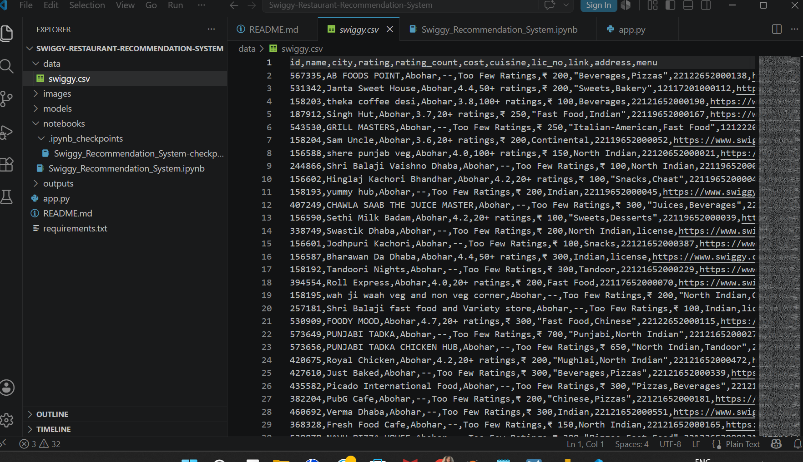
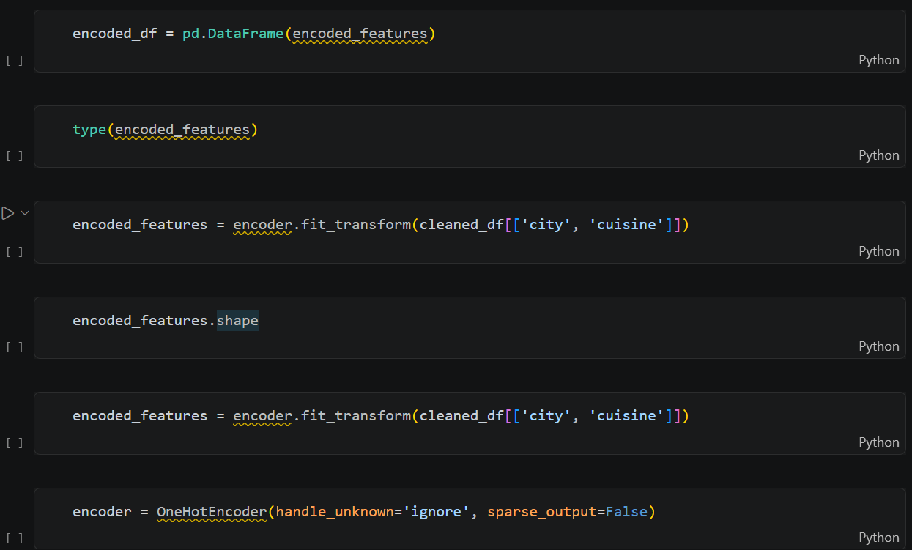
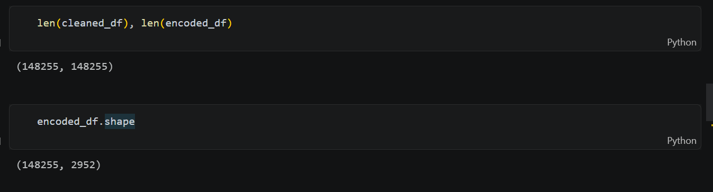
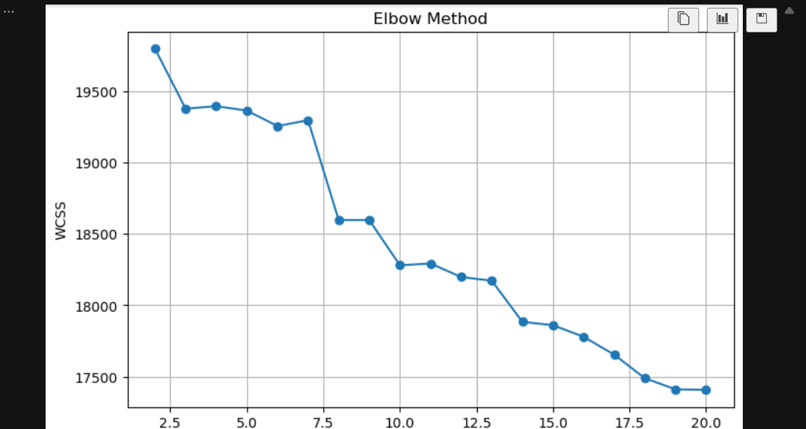
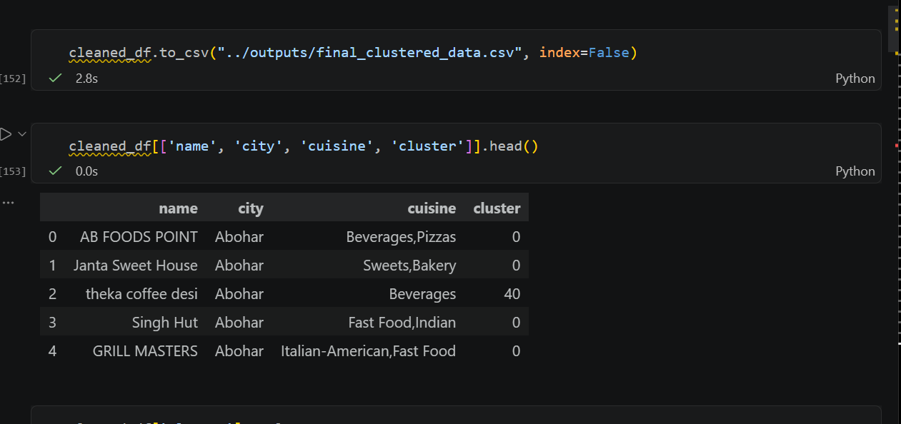
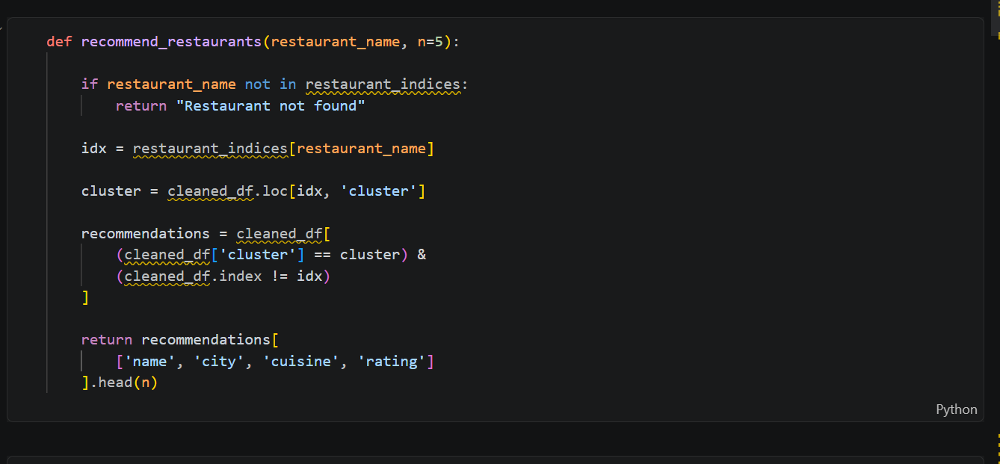
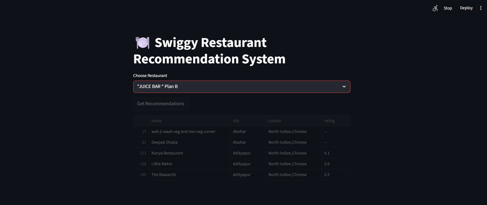
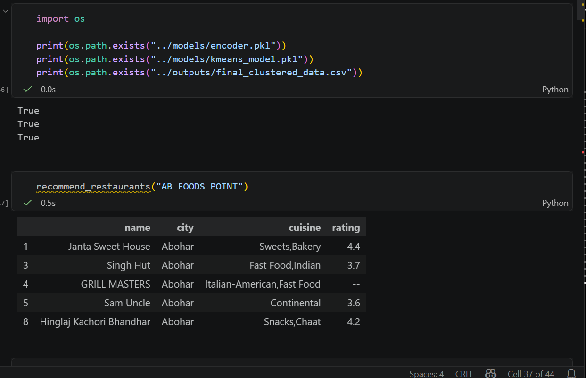
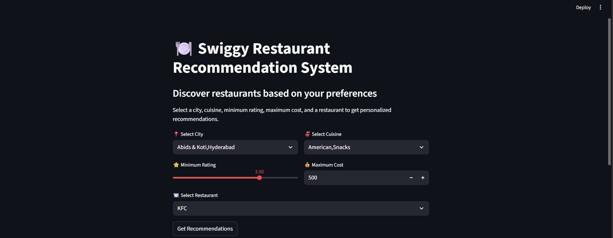

# 🍽️ Swiggy Restaurant Recommendation System

A Machine Learning-based Restaurant Recommendation System built using **Python**, **MiniBatch K-Means Clustering**, **Scikit-Learn**, and **Streamlit**.

The system recommends restaurants similar to a selected restaurant by clustering restaurants based on features such as **City**, **Cuisine**, **Rating**, and **Cost**.

---

# 📌 Project Overview

This project performs:

- Data Cleaning & Preprocessing
- Feature Engineering
- One-Hot Encoding
- Elbow Method for Optimal Cluster Selection
- MiniBatch K-Means Clustering
- Restaurant Recommendation Engine
- Interactive Streamlit Web Application

---

# 🚀 Features

- 🍽️ Restaurant Recommendation Engine
- 📍 City-based Filtering
- 🍜 Cuisine-based Filtering
- ⭐ Rating Filter
- 💰 Cost Filter
- ⚡ Fast MiniBatch K-Means Clustering
- 💻 Interactive Streamlit Interface
- 💾 Model Persistence using Joblib

---

# 📂 Project Structure



```text
Swiggy-Restaurant-Recommendation-System/
│
├── data/
│   └── swiggy.csv
│
├── images/
│
├── models/
│   ├── encoder.pkl
│   └── kmeans_model.pkl
│
├── notebooks/
│   └── Swiggy_Recommendation_System.ipynb
│
├── outputs/
│   ├── cleaned_data.csv
│   ├── encoded_data.csv
│   └── final_clustered_data.csv
│
├── app.py
├── requirements.txt
└── README.md
```

---

# 🔥 Data Preprocessing

The dataset was cleaned before model training by:

- Removing duplicate records
- Handling missing values
- Cleaning categorical features
- Selecting important features

---

# 🔥 One-Hot Encoding

The categorical columns

- City
- Cuisine

were converted into numerical vectors using **Scikit-Learn OneHotEncoder**.

This allows the clustering algorithm to understand categorical restaurant information.



---

# 📊 Encoded Feature Matrix

After encoding,

- **148,255 restaurants**
- **2,952 encoded features**

were generated.



---

# 📈 Elbow Method

Before applying MiniBatch K-Means, the **Elbow Method** was used to determine the optimal number of clusters.

The graph plots **WCSS (Within Cluster Sum of Squares)** against different values of **K**. The point where the graph starts flattening represents the optimal number of clusters.

This helps avoid selecting too few or too many clusters.



---

# 🤖 MiniBatch K-Means Clustering

The encoded restaurant data was clustered using **MiniBatch K-Means**, which is more efficient than traditional K-Means for large datasets.

Restaurants with similar characteristics are grouped into the same cluster.



---

# 🍴 Recommendation Engine

The recommendation system follows these steps:

1. User selects a restaurant.
2. The system identifies its cluster.
3. Restaurants belonging to the same cluster are retrieved.
4. The top recommendations are displayed.



---

# 📋 Recommendation Output

Example recommendation generated for a selected restaurant.



---

# 🎯 Recommendation Results

Sample recommendations generated by the recommendation engine.



---

# 🌐 Streamlit Application

The recommendation system is deployed using **Streamlit**.

Users can:

- 📍 Select City
- 🍜 Select Cuisine
- ⭐ Choose Minimum Rating
- 💰 Set Maximum Cost
- 🍽️ Select Restaurant
- 🚀 Generate Recommendations Instantly

### Streamlit Interface



---

# 🛠️ Technologies Used

- Python
- Pandas
- NumPy
- Matplotlib
- Scikit-Learn
- MiniBatch K-Means
- OneHotEncoder
- Joblib
- Streamlit
- Jupyter Notebook

---

# 📈 Machine Learning Workflow

```text
Raw Dataset
      │
      ▼
Data Cleaning
      │
      ▼
Feature Selection
      │
      ▼
One-Hot Encoding
      │
      ▼
Elbow Method
      │
      ▼
MiniBatch K-Means Clustering
      │
      ▼
Restaurant Recommendation Engine
      │
      ▼
Streamlit Application
```

---

# 📦 Installation

Clone the repository

```bash
git clone https://github.com/your-username/Swiggy-Restaurant-Recommendation-System.git
```

Move into the project folder

```bash
cd Swiggy-Restaurant-Recommendation-System
```

Install dependencies

```bash
pip install -r requirements.txt
```

Run the application

```bash
streamlit run app.py
```

---

# 👩‍💻 Author

## Tania Banerjee

- Python
- SQL
- Advanced Excel
- Machine Learning
- Data Analytics

---

# ⭐ Future Enhancements

- Content-Based Recommendation
- Collaborative Filtering
- Restaurant Search
- Cloud Deployment
- Personalized User Recommendations
- Rating-Based Recommendation Ranking

---

# 📜 License

This project is developed for educational and portfolio purposes.
